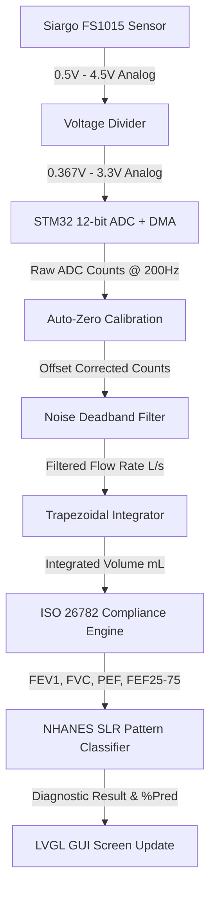
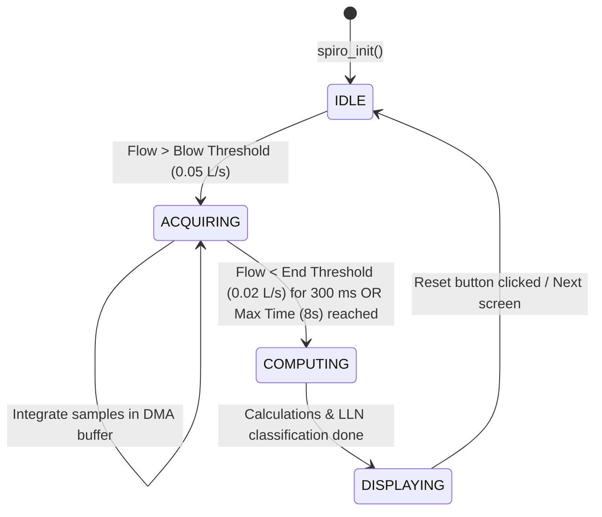

# Resource-Efficient Embedded Spirometer
### Real-Time Respiratory Monitoring & Diagnostic Classification on STM32

This repository implements a **portable, resource-efficient embedded spirometer** for real-time respiratory health monitoring. The system acquires flow data from a biomedical mass flow sensor, performs calibration and noise-filtering, computes lung function parameters compliant with ISO 26782 standards, classifies the diagnostic pattern, and displays the results with real-time graphs on an LCD screen.

Developed as part of **UROP – SRM Institute of Science and Technology**.

---

## System Architecture & Hardware

The device is built using constraint-optimized firmware designed for low-power microcontrollers with limited memory.

- **Microcontroller**: STM32F401CCU6 (ARM Cortex-M4, 84 MHz, 256 KB Flash, 64 KB RAM).
- **Flow Sensor**: **Siargo FS1015** MEMS mass flow sensor (0 to 100 SLPM, analog 0.5V to 4.5V output, 8 ms response time).
- **Voltage Divider**: A resistive voltage divider scales the sensor's 4.5V max output down to the MCU's 3.3V ADC rail (protecting the ADC pin and aligning 100 SLPM with full-scale ADC counts).
- **Display & Touch**: **ILI9341** LCD screen (240x320, SPI-based) driven by **LVGL 9** and the **XPT2046** resistive touch controller.

---

## Data Acquisition & Signal Processing Pipeline

The signal processing pipeline executes in real-time, mapping raw voltage inputs to clinical diagnostic metrics:



1. **ADC Sampling**: Hardware samples at $200\text{ Hz}$ ($5\text{ ms}$ interval), which is $2.5\times$ faster than the sensor's response time to ensure zero interpolation loss.
2. **Auto-Zero Calibration**: A startup offset is computed at boot when zero flow is present and subtracted from subsequent readings to correct base drift.
3. **Noise Deadband**: A deadband filter trims low-level sensor noise below $0.05\text{ L/s}$ to prevent idle volume accumulation (drift).
4. **Integration**: A trapezoidal numerical integration translates the flow rate ($L/s$) into cumulative volume ($L$). To conserve RAM, volume is stored in milliliters ($mL$) as a `uint16_t` rather than a $4$-byte `float`, saving $50\%$ of buffer memory with no clinical resolution loss.

---

## Firmware State Machine

The firmware processes exhalations using a structured state machine:



- **IDLE**: The system is calibrated and actively polls the ADC stream waiting for a forced exhalation to begin.
- **ACQUIRING**: Active flow integration. The system buffers raw ADC values and integrated volume arrays ($8\text{ s}$ hard limit / $1650$ samples max to fit the RAM budget).
- **COMPUTING**: Executes compliance checks, back-extrapolates Time Zero ($t_0$), calculates timed volumes, and evaluates diagnostic categories.
- **DISPLAYING**: Updates the LVGL graphs (Flow-Volume Loop and Volume-Time curve) and updates the clinical results table on the UI.

---

## Clinical Metrics & ISO 26782 Compliance

The spirometry engine conforms to key sections of **ISO 26782:2009**:

- **Time Zero Back-Extrapolation (§7.4)**: Instead of starting exhalation measurements from the ADC trigger threshold, the starting point ($t_0$) is back-extrapolated:
  $$t_0 = t_{\text{PEF}} - \frac{V_{\text{PEF}}}{\text{PEF}}$$
  This correction shifts the FEV1 and FEV6 integration windows to align with the true start of the blow.
- **Acceptability Filters (§7.5)**: Back-extrapolated volume ($\text{BEV}$) is evaluated. If $\text{BEV} \ge 0.150\text{ L}$ or $\text{BEV} \ge 5\%\text{ of FVC}$, the maneuver is flagged as poor/unacceptable effort.
- **End-of-Test Detection (§7.6)**: The exhalation is completed when the rate of change of volume drops below $0.025\text{ L}$ over a consecutive $1$-second window.

### Metrics Captured
- **FVC**: Forced Vital Capacity ($L$)
- **FEV1 / FEV6**: Forced Expiratory Volume in $1$ and $6$ seconds ($L$)
- **FEV1/FVC**: Expiratory ratio ($\%$)
- **PEF**: Peak Expiratory Flow ($L/s$)
- **FEF25-75 / FEF50**: Forced Expiratory Flow over mid-ranges ($L/s$)

---

## On-Device Diagnostic Classification

The firmware classifies exhalation profiles in real-time. It implements segmented linear regression (SLR) equations derived from the **NHANES 2007–2012** reference datasets to compute predicted parameters based on patient age, sex, and height.

By comparing the patient's results against the **Lower Limit of Normal (LLN)** ($5\text{th}$ percentile boundary), the system determines the clinical pattern:

$$\text{LLN} = \text{Predicted} - 1.645 \times \text{Residual SD}$$

| Diagnostic Pattern | FEV1/FVC Ratio | FVC | FEV1 |
|---|---|---|---|
| **NORMAL** | $\ge \text{LLN}$ | $\ge \text{LLN}$ | $\ge \text{LLN}$ |
| **OBSTRUCTION** | $< \text{LLN}$ | - | - |
| **RESTRICTIVE** | $\ge \text{LLN}$ | $< \text{LLN}$ | - |
| **MIXED** | $< \text{LLN}$ | $< \text{LLN}$ | - |
| **PRISm** | $\ge \text{LLN}$ | $\ge \text{LLN}$ | $< \text{LLN}$ |

---

## Repository Structure

```
Spirometer/
├── Docs/                  # Project specifications and literature study
└── Spirometer-STM32/      # Main STM32CubeIDE project root
    ├── Core/
    │   ├── Inc/           # Application header files (spirometry.h, xpt2046.h)
    │   └── Src/           # Application source code:
    │       ├── main.c          # System initialization & main event loop
    │       ├── spirometry.c    # Signal integration & ISO metric calculations
    │       ├── spiro_classify.c# SLR NHANES classification engine
    │       └── ui/             # EEZ Studio generated LVGL GUI screens
    ├── Drivers/           # ST HAL and CMSIS driver libraries
    └── ThirdParty/        # External middleware (LVGL v9 graphic library)
```

---

## Roadmap & Next Goals

### 1. Porting to FreeRTOS
To improve timing determinism and UI responsiveness, the codebase will be migrated to a FreeRTOS multitasking model:
- **Sampling Task (High Priority)**: A dedicated, deterministic task synchronized by ADC DMA half/full-complete interrupts to handle raw flow sampling, offset filtering, and integration.
- **UI/Graphics Task (Low Priority)**: Runs the LVGL timer handler (`lv_timer_handler()`) and canvas updates, ensuring screen rendering does not block or jitter the sensor sampling rates.
- **IPC (Inter-Process Communication)**: Utilize FreeRTOS message queues and event groups to send completed exhalation results from the sampler to the UI controller.

### 2. Reducing Memory Footprint
To fit comfortably within the STM32F401's tight $64\text{ KB}$ RAM limit:
- **Buffer Optimization**: Reorganize the raw ADC sampling buffers (`s_raw` and `s_vol`) using circular buffers or dynamic downsampling post-maneuver.
- **LVGL Heap Size Reduction**: Fine-tune the static allocation heap (`LV_MEM_SIZE` in `lv_conf.h`) and display draw buffers to minimize BSS segment footprint.
- **Fixed-Point Conversion**: Convert floating-point mathematical computations (e.g. NHANES prediction equations) to fixed-point integer math to reduce flash overhead and execution time.
